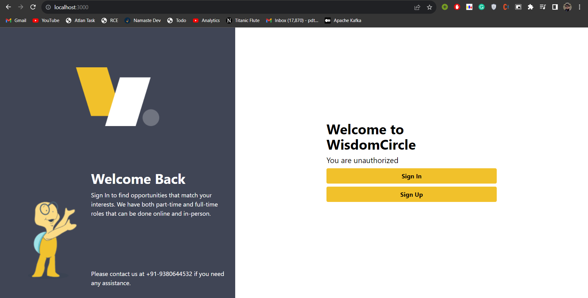

# Authentication Service

This authentication service is built using React, Redux, Nest.js, Tailwind CSS, and MySQL. It provides secure user authentication features for your web applications. Users can sign up, log in, change their password. The service integrates front-end and back-end components seamlessly and u can run the service in a docker container.


## Features

Frontend is built using React and Tailwind CSS, offering a clean and intuitive interface for users and provide below mentione features.

Sign Up
Sign In
Forgot Password/ Reset Password




## Authors

- [@kartikpapney](https://github.com/kartikpapney)


## Tech Stack

**Client:** Javascript, React, Redux, Tailwind CSS, localstorage

**Server:** NestJS, Typescript

**Database:** MySQL

**Tools:** Docker, VS Code, Postman

## Clone Project

Clone the project
Go to the project directory

## Installation

The project can run locally on docker container. Make sure you have Docker properly installed on your system. Just run the below commands or if you're in windows platform you can execute windows.bat

```bash
  1. docker compose build
  2. docker compose up
```